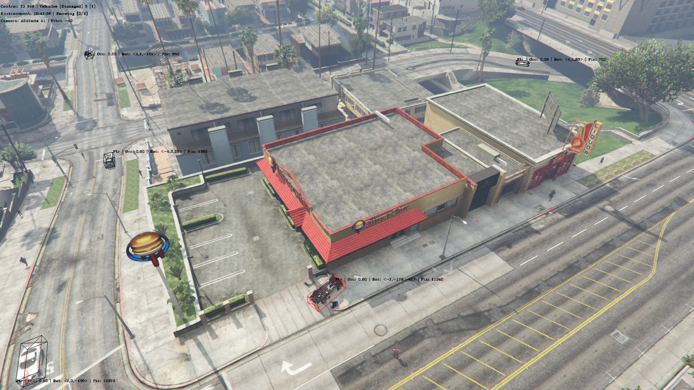

This repository supports the autonomous extraction and dense-annotation of simulated vehicle accident scenarios, as viewed from an aerial perspective, from Grand Theft Auto V (GTA). The data are used to train a modified, YOLO-based 2-stage with a Faster R-CNN-like head for pose estimation and damage status classification.  

Aerial vehicle and vehicle damage (VAVD) underly the operation of a novel drone-based infrastructure for responding to and recording urban vehicle accidents (UVAs), hereon referred to as a Drone Response Service (DRS). All coding scripts are provided as an addendum to the thesis titled: *"Vehicle accident feature extraction from a drone-based video feed"*. 

Assets are divided by:
1. [Simulation](gta/)
2. [Annotation Processing](annotations/)
3. [Model Training and Validation](ml/)

A sample, simulated, annotated wide-view UVA scenario is shown below:

